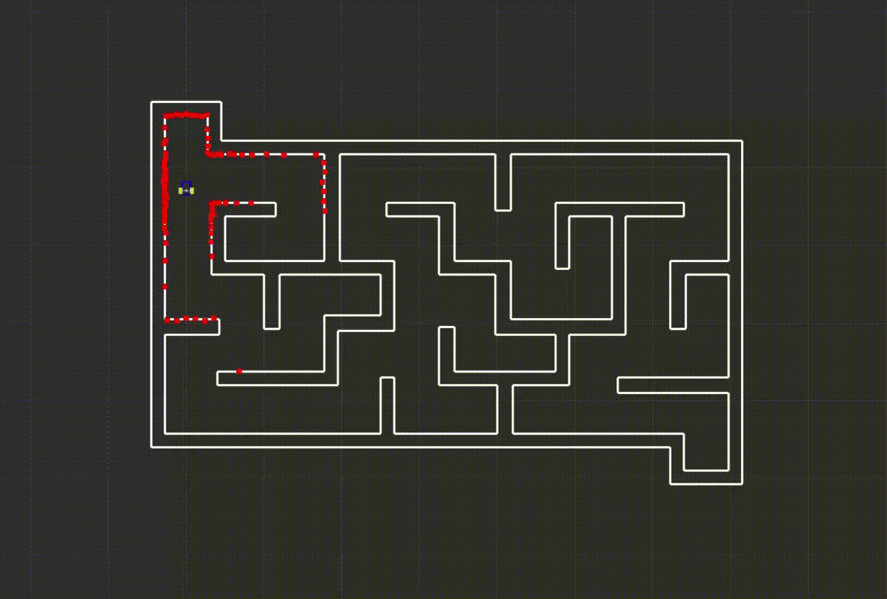
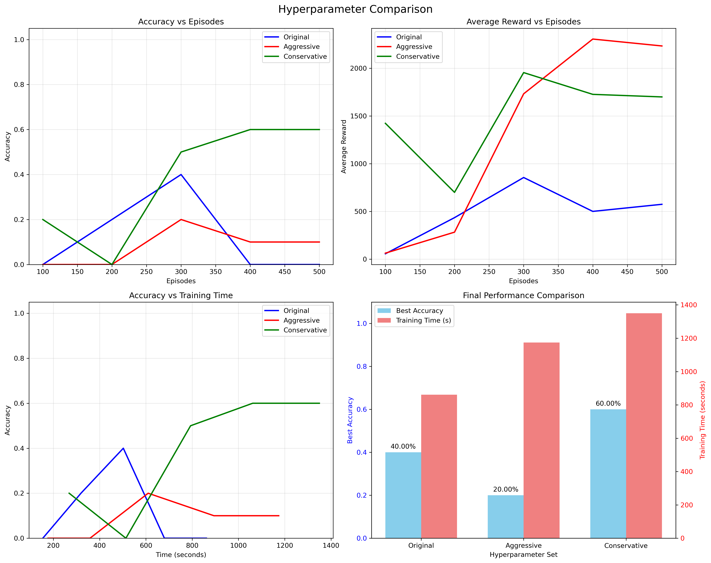

# Flatland Reinforcement Learning in ROS 2

## Project Report

[Project Report](report/Report-Flatland-Project.pdf)

## Description

This project aims to train a 2-dimensional robotic agent using ROS2 to perform a navigation task, in maze-like environments. The agent is based on the SERP robot platform and equipped with a simulated LiDAR sensor. For simulation purposes, we will use the Flatland 2D simulator, which offers lightweight and fast performance suitable for reinforcement learning experiments.

The integration between ROS2, Flatland, and the training environment is achieved by adapting the reinforcement learning pipeline developed by the project "ros2_flatland_rl_tutorial", from the user FilipeAlmeidaFEUP. This pipeline provides a solid foundation for combining ROS2 and Flatland with the Gym interface and Stable Baselines for training RL models.

In this project, the original implementation is expanded to include **comprehensive hyperparameter optimization**, **automated training analysis**, and **robust performance comparison** across different PPO configurations to better understand how well the training pipeline can generalize to a multitude of map configurations.

## New Features

### Hyperparameter Optimization
The system now includes three pre-configured hyperparameter sets optimized for different training scenarios:

- **Original**: Balanced parameters for general performance
- **Aggressive**: Fast learning with higher exploration
- **Conservative**: Stable, slow learning with high precision

### Automated Performance Analysis
- **Real-time training monitoring** with accuracy and reward tracking
- **Comparative visualization** of different hyperparameter sets
- **Automated model saving** for best-performing configurations
- **Early stopping** when target accuracy (80%) is reached

### Robust Training Pipeline
- **Error handling and recovery** during training
- **Deterministic evaluation** for consistent results
- **Comprehensive logging** of training progress
- **JSON export** of training results for further analysis

In this project, the original implementation is expanded in order to better understand how well the training pipeline can generalize to a multitude of map configurations.

Below is an example of the ROS2-based agent running inside the Flatland simulator:



## Getting Started

### VM

Using a Virtual Machine engine such as VirtualBox or VMware, you can use the provided [VM provided](https://drive.google.com/file/d/1Wte7yGi9puJU5gR8mpzAtvtKOPtoYKEJ/view?usp=sharing). This VM has all the necessary packages already installed and configured, including a fresh install of ROS 2 Humble on Ubuntu, and a workspace for flatland.
We recommend allocating as much resource as possible to this virtual machine, as the agent training process takes a large amount of steps and can become resource hungry in sandboxed environment.

Obs: the VM password is `ros2`

Clone this repository to the `~/ros2_ws/src` folder:
```bash
git clone https://github.com/MekhyW/ros2_flatland_rl.git
```

Build the project and install dependencies:
```bash
cd ..
rosdep install -i --from-path src --rosdistro humble -y
colcon build
pip install gym
pip install stable_baselines3
pip install matplotlib  # Required for training visualizations
```

### Running the code

Source the installation:
```bash
source install/setup.bash
source /opt/ros/humble/setup.bash
```

Run the launch file:
```bash
ros2 launch serp_rl serp_rl.launch.py
```

At this point, if no errors occur, you should be seeing the following world:


The robot is currently using the Proximal Policy Optimization (PPO) algorithm to learn how to navigate the hallway from one end to the other. In the beginning, the robot is just exploring the environment and practically taking random actions. Over time, it starts to learn what to do in the different scenarios and it will improve at the task.

The target area is represented by the green circle and, every time the task is restarted, the initial and final positions swap so the robot learns how to turn to both the left and the right. The task is restarted if it fails if there are any collisions, if it takes too much time or if it succeeds (reaches the end).

NOTE: The layers were set up in order to accommodate the necessary collisions and lasers. If you're having trouble understanding the logic, revisit this [Google Slides presentation on how to manage layers](https://docs.google.com/presentation/d/1KqJDQR_PBaGtS-kA5KgsTbaRThu_uP2U8NJeoSP0GDE/edit?usp=sharing). The last slide shows the layer graph for this world.

As using RL can be very time-consuming, this simulation was sped up. This can be done by modifying the `update_rate` in Flatland.

NOTE: If you are using the VM and are running into performance issues, it might be a good idea to lower the `update_rate`.

The next sections will explain how the code from the controller needs to be organized to use any RL algorithm provided by Stable-Baselines3.

## Setup the Environment

### \_\_init\_\_ fuction

Inside the init function you need to initialize the `action_space`, `observation_space` and `state` variables. 

Let us start by choosing the actions the robot can perform. For this project, there are three possible actions, executable by changing the robot's linear and angular velocity:
1. Move Forward
2. Rotate Left
3. Rotate Right

Then we need to choose what a state of our environment looks like (the `observation_space`). For that, we'll use the readings from the LiDAR. Since using all 90 rays would give a state space too large that would take too long for the agent to train in, we need to sample the readings. To do that, The LiDAR was divided into 9 equal sections, and from each we get the closest reading. This means that our observation space is composed of 9 floating point values.

NOTE: In more conventional definitions of a state in RL, the agent has total knowledge of the environment (position of all entities, shape of the map, etc.). In this case (and a lot of other Robot Learning applications), the agent can only know what the robot knows, which is the LiDAR readings.

To actually initialize the variables, we need to define their shape using [Gym Spaces](https://www.gymlibrary.dev/api/spaces/). For this project, these shapes are used:
```
from gym.spaces import Discrete, Box

# action is an integer between 0 and 2 (total of 3 actions)
self.action_space = Discrete(3)

# state is represented by a numpy.Array with size 9 and values between 0 and 2
self.observation_space = Box(0, 2, shape=(9,), dtype=numpy.float64)

# after the observation space is defined, you can declare the initial state 
self.state = numpy.array(self.lidar_sample)
```

### step function

In RL a step is the process that is constantly being repeated and consists of:
1. Receiving the action decided by the agent for the current state and executing it.
2. Determining the new state.
3. Calculate the reward based on the old and new states and the action.
4. Check if a final state was reached and the environment needs to be reset.

In the code for this package, this equates to:
1. Changing the robot speed based on the action chosen.
2. Wait for the action to be completed. In this case, the action finishes when the next LiDAR reading is published. This means each step lasts the same as the update rate of the LiDAR, 0.1 seconds.
3. Calculate the reward based on events detected in the simulation while performing the action and other available information.
4. Determines if it is a final state based on events from subscribed topics during the action (collisions or end reached) or the number of actions already taken (times out at 200 steps).

Returns: The current state, the reward, and if it reached a final state (boolean). 

#### Calculating the Reward

The events that trigger rewards for an action are:

- Detecting the end was reached (large positive reward)
- Detecting a collision (large negative reward)
- Exceeding the maximum number of steps (large negative reward)
- Choosing the action to move forward (small positive reward)

NOTE: The reward calculation can still be improved, allowing the agent to train faster. A good exercise for you would be to think of other things that can be added to help the robot complete the task. Hint: take advantage of all information available, like old and new lidar readings and the action taken.

### reset function

An episode, in the context of RL, is the set of steps between an initial state and a final state. The reset function has the task of starting a new episode by setting the environment back to an initial state. In this case, this means:
- Placing all the models (SERP and End beacon) in starting positions.
- Resetting all variables that need to.
- Determine the new initial state (next reading from the Lidar).

Returns: The initial state.

### Other functions

- render: Used to render your environment. Not needed here since it is already rendered in Flatland.
- close: Runs when the environment is no longer needed. Can be used to close no longer necessary ROS 2 processes.

## Running the RL algorithm

The more recently developed RL algorithms are very effective but also very hard to understand. The good news is that, thanks to the Stable-Baselines3 package, you can completely abstract from how the algorithm works. In fact, if you have a properly setup environment, getting an algorithm to run an agent on it only takes a few lines of code:

```
from stable_baselines3 import PPO
from stable_baselines3.common.env_checker import check_env

env = Env()

# optional but launches exceptions with helpful messages debug your environment if it has errors
check_env(env)

# create the agent for the PPO algorithm and assign one of the predefined policies and the environment
agent = PPO("MlpPolicy", env)

# letting the agent learn for 25000 steps
agent.learn(total_timesteps=25000)
```

Go to the [documentation](https://stable-baselines3.readthedocs.io/en/master/guide/algos.html) to see all available RL algorithms in this package. Notice that you can swap between algorithms with very few changes to the code.

After the training is complete, you can test your model by manually calling the environment functions:
```
obs = self.reset()
while True:
  # returns an action based on what it learned
  action, _states = agent.predict(obs)
  
  obs, rewards, done = self.step(action)
  if done:
    self.reset()
```

You can easily store your trained agent in a file and load it later with the functions:
```
agent.save("ppo")
agent = PPO.load("ppo")
```

This code needs to run in parallel with the ROS2 processes so threading was used.

The function `learn` trains the agent for a given number of steps, which does not guarantee that by the end of training the agent will be capable of performing the task. To make sure your agent is properly trained, you need to think what is the best strategy to train it. This section will present you with an option to resolve this issue.

### Training Strategies

The goal is to make sure you end up with an agent capable of completing the task, meaning that it needs to somehow be validated. One possible solution, which is used in this project, is to follow these steps:

1. Train for a given number of steps.
2. Test the agent for a set number of episodes and determine the accuracy (number of successful episodes divided by the total number of episodes)
3. If the accuracy is above a given threshold finish training, otherwise go back to step 1. 

## Training System

### Hyperparameter Sets

The system automatically tests three different hyperparameter configurations:

#### Original Configuration
- **Learning Rate**: 3e-4
- **Batch Size**: 64
- **N Steps**: 2048
- **Clip Range**: 0.2
- **Best for**: Balanced performance across different environments

#### Aggressive Configuration  
- **Learning Rate**: 5e-4 (higher)
- **Batch Size**: 128 (larger)
- **N Epochs**: 20 (more updates)
- **Clip Range**: 0.3 (more aggressive updates)
- **Best for**: Fast convergence in simple environments

#### Conservative Configuration
- **Learning Rate**: 1e-4 (lower)
- **Batch Size**: 32 (smaller)
- **N Steps**: 4096 (more experience)
- **Clip Range**: 0.1 (more stable updates)
- **Best for**: Complex environments requiring stable learning


### Training Results

Based on our experiments with the circular obstacle map, here are the comparative results:

| Configuration | Best Accuracy | Training Time | Episodes to 80% |
|---------------|---------------|---------------|-----------------|
| Original      | [0.4%]        | [861.4262011051178 sec]   | [500 episodes]  |
| Aggressive    | [0.2%]        | [1174.0944955348969 sec]   | [500 episodes]  |
| Conservative  | [0.6%]        | [1349.6461951732635 sec]   | [500 episodes]  |


The system automatically generates comparison plots showing:
- **Accuracy vs Episodes**: Learning curve progression
- **Average Reward vs Episodes**: Reward optimization over time  
- **Accuracy vs Training Time**: Efficiency comparison
- **Final Performance Comparison**: Bar chart summary



## Performance Monitoring

The training system provides comprehensive monitoring:

### Real-time Logging
```
[Original] Episodes: XXX, Accuracy: XX.X%, Avg Reward: XXX.X
[Original] End states: Finished: X, Collisions: X, Timeouts: X
```


## Setup the Environment

### Environment Configuration

The environment uses a **9-dimensional observation space** derived from LiDAR readings, divided into equal angular sections for computational efficiency. The **3-action discrete space** includes:

1. **Move Forward** - Linear velocity with no rotation
2. **Rotate Left** - Pure rotation (counter-clockwise)
3. **Rotate Right** - Pure rotation (clockwise)

### Reward System

The reward system has been optimized for faster convergence:

- **Goal Achievement**: +400 base reward + time bonus (up to +200)
- **Collision**: -200 penalty
- **Timeout**: -500 penalty  
- **Forward Movement**: +2 reward for exploration
- **Progress Bonus**: +5 additional reward for getting closer to goal

### State Representation

The state consists of normalized LiDAR readings (0-1 range) with robust error handling:
- **NaN/Inf filtering** for sensor noise
- **Timeout protection** for sensor failures
- **Validation checks** to ensure state consistency

## Available Maps

The system includes both full-size and optimized small maps for faster training:

### Full-Size Maps
1. **circular_map**: Scattered circular obstacles for general navigation
2. **corridor_map**: Narrow hallway navigation
3. **maze_map**: Complex pathfinding challenges
4. **room_map**: Multi-room traversal
5. **turn_map**: L-shaped navigation requiring sharp turns

### Small Maps (Optimized for Training)
- **circular_map_small**: 250x250px with 5 circular obstacles
- **corridor_map_small**: 300x150px linear corridor
- **maze_map_small**: 250x250px compact maze
- **room_map_small**: 300x200px two-room layout
- **turn_map_small**: 200x200px L-shaped corridor

All small maps use 0.04m resolution and are designed for training convergence within 500 episodes.

### Map Creator Tools

Two Python utilities are provided for custom map generation:

- **`maps_creator.py`**: Generates full-size maps
- **`small_maps_creator.py`**: Creates training-optimized smaller maps

Both tools automatically generate the required PNG and YAML file pairs.

## Configuration

### Switching Maps
Edit `world/world.yaml` to change the active map:
```yaml
layers:
  - name: ["collisions_layer", "serp_laser_layer"]
    map: "circular_map_small.yaml"  # Change this line
```

### Adjusting Training Parameters
Modify the hyperparameter sets in `serp_rl/__init__.py`:
```python
hyperparameter_sets = {
    "Custom": {
        "learning_rate": 2e-4,
        "batch_size": 64,
        "n_steps": 1024,
        # ... other parameters
    }
}
```

### Training Duration
Control training length by adjusting:
- `max_episodes`: Maximum episodes per hyperparameter set
- `episodes_per_eval`: Episodes between evaluation runs
- `eval_episodes`: Number of episodes for accuracy 


## Results Analysis

### Automated Outputs
After training completion, the system generates:

1. **`hyperparameter_comparison_YYYYMMDD_HHMMSS.png`**: Visualization plots
2. **`hyperparameter_results_YYYYMMDD_HHMMSS.json`**: Raw data for analysis
3. **`ppo_best_[Configuration].zip`**: Best-performing model files
4. **`ppo_final_[Configuration].zip`**: Final model states

### Custom Analysis
The JSON output enables custom analysis:
```python
import json
with open('hyperparameter_results_YYYYMMDD_HHMMSS.json', 'r') as f:
    results = json.load(f)
    
# Analyze convergence rates, final performance, etc.
```
## Available Maps

The following custom map configurations were created for testing:

1) `circular_map`:
A map with several circular obstacles of varying sizes scattered across the space. Useful for training agents on general navigation and avoidance in open but cluttered environments.

2) `corridor_map`:
A narrow horizontal corridor with free space bordered by solid walls on top and bottom. This design is ideal for training agents in constrained linear navigation or movement in tight hallways.

3) `empty`:
A fully open space with no obstacles. Best used as a control or baseline scenario to test agent mobility without obstruction.

4) `maze_map`:
A map with a grid-like pattern of intersecting vertical and horizontal bars forming a simple maze. Trains the agent in decision-making and route planning within complex environments.

5) `obstacles_map`:
A few scattered rectangular obstacles in an otherwise open area. Good for basic avoidance tasks and testing spatial awareness.

6) `room_map`:
Resembles a multi-room layout separated by thin walls with openings. Designed to train the agent in room-to-room traversal and strategic pathfinding.

7) `turn_map`:
Features large black blocks forming an L-shaped passage, forcing the agent to make sharp turns. Ideal for training maneuverability and behavior at intersections or sharp corners.

All maps have a smaller counterpart, designed so that training and evaluation can be performed much faster (that is, convergence is expected in a smaller order of magnitude of steps).

To changed the map, edit the `world/world.yaml` file with the yaml file name of the map you want to apply. Then run `sudo colcon build` on the workspace root to make sure everything built correctly.

### Map Creator

In order to facilitate the process of customizing maps for experimenting, which can be quite tedious to do manually, the generator script located at `world/maps_creator.py` was made.

How it works:

Each map is created as a 2D numpy array where:

- White pixels (value 255) represent free space where robots can move
- Black pixels (value 0) represent obstacles or walls that block movement
- The maps use grayscale values to indicate occupancy probability

Output files:

For each map, the script generates two files:

- PNG file - The visual map image
- YAML file - Configuration file containing metadata like resolution (0.04 meters per pixel), origin coordinates, and occupancy thresholds

How to use it:

1) Run the script to generate all four map types automatically

2) Copy the generated files (.png and .yaml pairs) to your robotics project's world directory

3) Update your world configuration to reference the new maps

4) Adjust starting positions in your robot navigation code to match the map layout

## Next Steps

It would be very interesting if, with due collaboration with the ROS community, a custom Nav2 controller plugin was developed for the agent. This would allow the robot to leverage its learned policy in navigation tasks.
